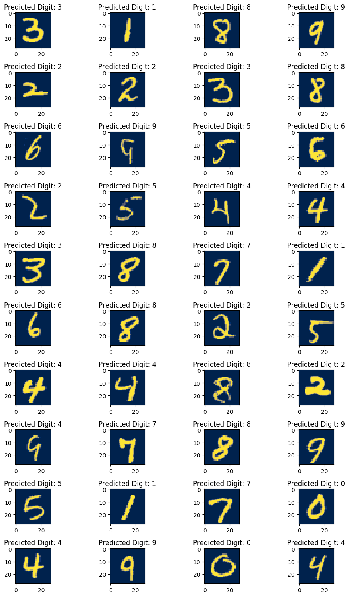

# MNIST-Dataset-ML-Project

This project demonstrates the training and evaluation of a neural network model on the MNIST dataset, a popular dataset of hand-written digits. The goal is to classify each image into one of the ten possible digit classes (0-9) using deep learning techniques. The project includes data loading, dataset creation, model definition, and training using k-fold cross-validation.

## Getting Started

Before running the code, make sure you have the necessary libraries installed. You can install them using pip (ideally in a python virtual environment or using conda):

```bash
pip install torch scikit-learn imbalanced-learn matplotlib tqdm
```

## Project Structure

The project is structured as follows:

- `README.md`: This document provides an overview of the project.
- `mnist.py`: The Python script containing the code for data loading, dataset creation, model definition, and training.
- `data/`: A directory that should contain the MNIST dataset files (`training.pt` and `test.pt`).

## Code Overview

### Import Libraries

The project begins by importing the necessary libraries, including PyTorch, scikit-learn, imbalanced-learn, matplotlib, and tqdm. It also checks for the availability of a CUDA-compatible GPU and sets the device accordingly.

### Load MNIST Data

The MNIST dataset is loaded from the provided data files `training.pt` and `test.pt`.

### Dataset Object

A custom `CTDataset` class is defined to preprocess the dataset. It normalizes the pixel values to the range [0, 1] and provides a convenient way to access the data.

### Neural Network

The neural network architecture (`MyNeuralNet`) is defined, consisting of three connected layers with ReLU activation functions. The input size is 28x28 pixels (784), and the output size is 10 (for the ten digit classes).

### Training Function

The `train_model_kfold` function performs k-fold cross-validation training on the dataset. It uses Stochastic Gradient Descent (SGD) optimization with a learning rate of 0.01 and Cross-Entropy Loss. For each fold:

1. Train and validation subsets are created.
2. Data oversampling is performed using RandomOverSampler to handle class imbalance.
3. Dataloaders are created with a batch size of 20.
4. The model is trained for a specified number of epochs.
5. Validation accuracy is calculated and printed for each fold.

## Results

The script provides validation accuracy for each fold during k-fold cross-validation. The final results include accuracy scores for all folds, helping assess the model's performance.

### Predicted Digits for a Subset of Images



This plot displays predicted digits for a subset of images from the MNIST dataset.
